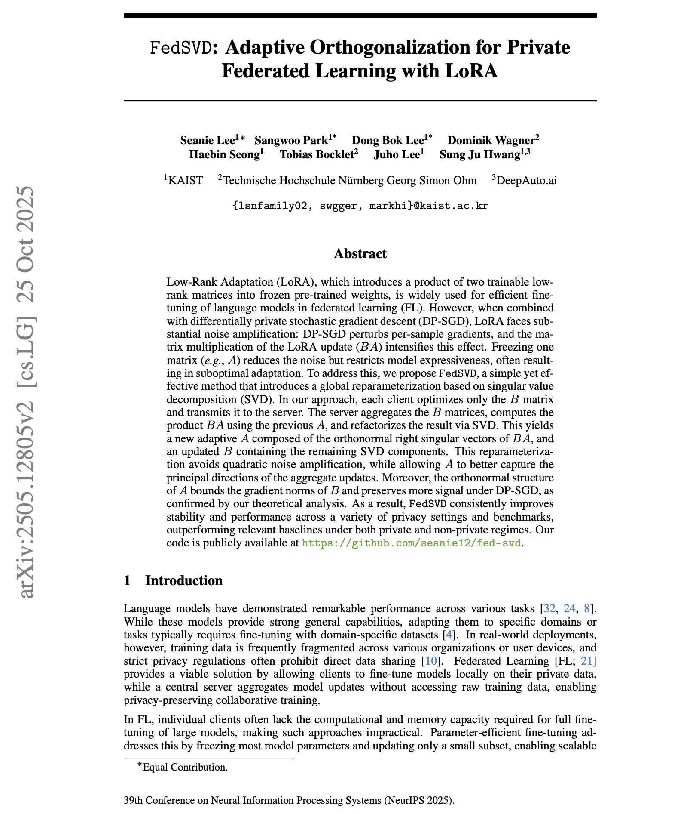

# FedSVD: Adaptive Orthogonalization for Private Federated Learning with LoRA
[](https://arxiv.org/abs/2505.12805)

This repository contains the codebase for our paper, "**FedSVD: Adaptive Orthogonalization for Private Federated Learning with LoRA**."

---

## Abstract

<p align="center">
  <a href="https://arxiv.org/abs/2505.12805">
    
  </a>
</p>

---

## Quick Start
```
conda create -n fed-svd python=3.10
conda activate fed-svd
pip install -r requirements.txt
```

## Download Dataset and Training

Download the dataset from [here](https://drive.google.com/file/d/1Q74mdu0ABsOD0VCkDQgx7p1fP8rkW2WS/view). Unzip it and place the `data` folder in the project root directory (same level as `main.py`).

Supported tasks: `sst2`, `mnli`, `qqp`, `qnli`

### Differential Privacy Training
```bash
bash scripts/train_dp.sh [DEVICE] [TASK]
# Example:
bash scripts/train_dp.sh 0,1,2 sst2
```

### Non-Differential Privacy Training
```bash
bash scripts/train_non_dp.sh [DEVICE] [TASK]
# Example:
bash scripts/train_non_dp.sh 0,1,2 mnli
```

**Parameters:**
- `DEVICE`: Comma-separated GPU IDs (e.g., `0` or `0,1,2`)
- `TASK`: One of {`sst2`, `mnli`, `qqp`, `qnli`}

---

## Repository Structure

```
fed-svd/
├── main.py                 # Entry point for training
├── parser.py               # Command-line argument parser
├── dataset/                # Dataset loading and preprocessing
├── fedmm/                  # Federated learning implementations
│   └── fedavg/
│       ├── client.py       # Client-side training logic
│       └── server.py       # Server-side aggregation logic
├── misc/                   # Utility functions
│   └── utils.py           # Helper functions for model, training, etc.
├── modules/                # Core modules
│   ├── federated.py       # Base federated learning classes
│   ├── logger.py          # Logging utilities
│   ├── multiprocs.py      # Multi-process management
│   └── early_stopping.py  # Early stopping implementation
└── scripts/               # Training scripts
    ├── train_dp.sh        # DP training script
    └── train_non_dp.sh    # Non-DP training script
```

---

## Citation
```
@inproceedings{
lee2025fedsvd,
title={Fed{SVD}: Adaptive Orthogonalization for Private Federated Learning with Lo{RA}},
author={Seanie Lee and Sangwoo Park and Dong Bok Lee and Dominik Wagner and Haebin Seong and Tobias Bocklet and Juho Lee and Sung Ju Hwang},
booktitle={The Thirty-ninth Annual Conference on Neural Information Processing Systems},
year={2025},
url={https://openreview.net/forum?id=Qq19n9LZ97}
}
```